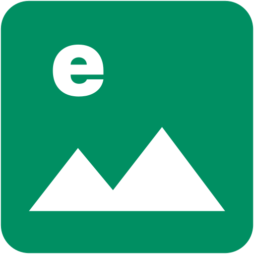

<div align="center">
  
  <h1>emage</h1>
  <p><strong>A powerful, privacy-first image manipulation tool that runs entirely in your browser</strong></p>
  
  <p>
    <a href="#features">Features</a> •
    <a href="#demo">Demo</a> •
    <a href="#installation">Installation</a> •
    <a href="#usage">Usage</a> •
    <a href="#deployment">Deployment</a> •
    <a href="#contributing">Contributing</a>
  </p>
</div>

---

## 🚀 Overview

**emage** is a client-side image manipulation application built with modern web technologies. All image processing happens directly in your browser - your images never leave your device, ensuring complete privacy and security.

Perfect for quick image edits without uploading to third-party services!

## ✨ Features

### 🎨 Image Transformations
- **Rotation**
  - Precise angle control with slider (0-359°)
  - Quick rotate buttons (90°, 180°, 270°)
  - Real-time preview
  
- **Flip**
  - Horizontal flip
  - Vertical flip
  - Combine for various effects

- **Crop**
  - Mobile-style interactive crop overlay
  - Multiple aspect ratios:
    - Free crop
    - Square (1:1)
    - Standard photo (4:3, 3:4)
    - Widescreen (16:9, 9:16)
    - Classic photo (3:2, 2:3)
  - Drag to reposition, handles to resize

### 🎭 Filters & Adjustments
- **Black & White** - Convert to grayscale
- **Brightness** - Adjust from dark to bright (-1 to +1)
- **Contrast** - Control contrast levels (-1 to +1)
- **Saturation** - From desaturated to vibrant (-1 to +1)
- Real-time filter preview

### 📐 Resize Options
- **By Dimensions**
  - Set specific width/height
  - Lock aspect ratio option
  - Proportional scaling
  
- **By File Size**
  - Target specific file size in KB
  - Automatic quality optimization
  - Smart compression algorithm

### 💾 Export
- **Multiple formats**: PNG, JPEG, WebP
- **Quality control**: Adjustable compression for lossy formats
- **Custom filename**: Name your exports
- One-click download

## 🎯 Demo

<!-- Add your demo GIF or screenshots here -->
<!--  -->

### Interface Preview

1. **Upload Section**: Drag & drop or click to select images
2. **Canvas Area**: Live preview of your edits
3. **Control Panels**: Intuitive controls for all editing features
4. **Export Options**: Choose format and download

## 🛠 Tech Stack

- **Frontend Framework**: [Vue 3](https://vuejs.org/) with Composition API
- **Language**: [TypeScript](https://www.typescriptlang.org/)
- **Canvas Manipulation**: [Fabric.js](http://fabricjs.com/) v7
- **UI Framework**: [DaisyUI](https://daisyui.com/) + [TailwindCSS](https://tailwindcss.com/)
- **Build Tool**: [Vite](https://vitejs.dev/)
- **Package Manager**: [Bun](https://bun.sh/)
- **Containerization**: Docker with Nginx

## 📦 Installation

### Prerequisites

- [Bun](https://bun.sh/) (v1.0.0 or higher)
- Node.js (v18 or higher) - if not using Bun
- Docker (optional, for containerized deployment)

### Local Development Setup

1. **Clone the repository**
   ```bash
   git clone https://github.com/Prastavna/emage.git
   cd emage
   ```

2. **Install dependencies**
   ```bash
   bun install
   ```

3. **Start development server**
   ```bash
   bun run dev
   ```

4. **Open your browser**
   ```
   http://localhost:5173
   ```

### Build for Production

```bash
# Build the application
bun run build

# Preview the production build
bun run preview
```

The built files will be in the `dist` directory.

## 🚀 Deployment

### Docker Deployment (Recommended)

#### Quick Start with Docker Compose

```bash
# Build and start
docker-compose up -d

# Access at http://localhost:3000
```

#### Using Docker CLI

```bash
# Build image
docker build -t emage .

# Run container
docker run -d -p 3000:80 --name emage-app emage
```

For detailed deployment instructions, see [DEPLOYMENT.md](DEPLOYMENT.md)

### Deploy to Cloud Platforms

The Docker container can be deployed to:
- AWS (ECS, Fargate, EC2)
- Google Cloud (Cloud Run, GKE)
- Azure (Container Instances, AKS)
- DigitalOcean App Platform
- Heroku Container Registry
- Fly.io

### Static Hosting

Since the app is entirely client-side, you can also deploy the `dist` folder to:
- Vercel
- Netlify
- GitHub Pages
- Cloudflare Pages
- AWS S3 + CloudFront

## 📖 Usage

### Basic Workflow

1. **Upload an Image**
   - Drag and drop an image onto the upload area
   - Or click to browse and select a file
   - Supports: JPG, PNG, GIF, WebP

2. **Edit Your Image**
   - Use the sidebar controls to apply transformations
   - All changes are applied in real-time
   - Preview on the canvas

3. **Export**
   - Choose your preferred format (PNG, JPEG, WebP)
   - Adjust quality if needed
   - Click download

### Tips

- **Rotation**: Use the slider for precise angles, or quick buttons for common rotations
- **Crop**: Enter crop mode, select aspect ratio, then drag and resize the crop box
- **Filters**: Combine multiple filters for unique effects
- **Reset**: Each section has reset/cancel options to undo changes

## 🏗 Project Structure

```
emage/
├── src/
│   ├── components/         # Vue components
│   │   ├── ImageUpload.vue
│   │   ├── ImageEditor.vue
│   │   ├── CropOverlay.vue
│   │   ├── RotationControls.vue
│   │   ├── FilterControls.vue
│   │   ├── ResizeControls.vue
│   │   ├── CropControls.vue
│   │   └── ExportControls.vue
│   ├── composables/        # Vue composables
│   │   └── useImageEditor.ts
│   ├── assets/            # Static assets
│   ├── App.vue            # Root component
│   ├── main.ts            # Application entry
│   └── style.css          # Global styles
├── public/                # Public assets
├── dist/                  # Build output
├── Dockerfile            # Docker configuration
├── docker-compose.yml    # Docker Compose config
├── nginx.conf            # Nginx configuration
├── DEPLOYMENT.md         # Deployment guide
├── CONTRIBUTING.md       # Contribution guidelines
└── README.md             # This file
```

## 🔒 Privacy & Security

### Your Data is Safe

- ✅ **100% Client-Side Processing** - All image manipulation happens in your browser
- ✅ **No Server Upload** - Images never leave your device
- ✅ **No Tracking** - No analytics or user tracking
- ✅ **No Storage** - Images are only in browser memory
- ✅ **Open Source** - Fully auditable code

### How It Works

1. You select an image from your device
2. JavaScript reads the file into browser memory
3. Fabric.js and Canvas API process the image
4. You download the edited version
5. Image data is cleared from memory when you close the tab

**Your images are never transmitted over the network.**

## 🤝 Contributing

We welcome contributions! Please see [CONTRIBUTING.md](CONTRIBUTING.md) for details on:

- How to set up the development environment
- Code style guidelines
- How to submit pull requests
- Reporting bugs and requesting features

### Quick Contribution Guide

1. Fork the repository
2. Create a feature branch (`git checkout -b feature/AmazingFeature`)
3. Commit your changes (`git commit -m 'Add some AmazingFeature'`)
4. Push to the branch (`git push origin feature/AmazingFeature`)
5. Open a Pull Request

## 🐛 Bug Reports & Feature Requests

Found a bug or have a feature idea?

- **Bug Reports**: [Open an issue](https://github.com/Prastavna/emage/issues/new?template=bug_report.md)
- **Feature Requests**: [Open an issue](https://github.com/Prastavna/emage/issues/new?template=feature_request.md)

## 📝 Development

### Available Scripts

```bash
# Development server with hot reload
bun run dev

# Type check without emitting files
bun run type-check

# Build for production
bun run build

# Preview production build locally
bun run preview

# Lint and fix files
bun run lint
```

### Tech Deep Dive

- **Vue 3 Composition API**: Reactive state management
- **TypeScript**: Type safety and better DX
- **Fabric.js**: Canvas manipulation and object handling
- **Vite**: Lightning-fast HMR and optimized builds
- **DaisyUI**: Pre-built accessible UI components
- **TailwindCSS**: Utility-first styling

## 🌟 Acknowledgments

- [Fabric.js](http://fabricjs.com/) for powerful canvas manipulation
- [Vue.js](https://vuejs.org/) for the reactive framework
- [DaisyUI](https://daisyui.com/) for beautiful UI components
- [Bun](https://bun.sh/) for blazing fast package management

## 📄 License

This project is licensed under the MIT License - see the [LICENSE](LICENSE) file for details.

## 🔗 Links

- **Repository**: [GitHub](https://github.com/Prastavna/emage)
- **Issues**: [Bug Tracker](https://github.com/Prastavna/emage/issues)
- **Discussions**: [Community Forum](https://github.com/Prastavna/emage/discussions)

---

<div align="center">
  <p>Made with ❤️ by the emage team</p>
  <p>
    <a href="#top">Back to Top ⬆️</a>
  </p>
</div>
